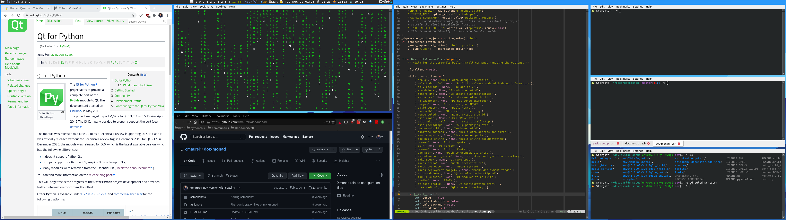

# dotxmonad

Simple xmonad configuration files, using smart spacing, a floating workspace,
and custom scripts to handle volume, brightness, and other simple
functionalities that you can find on my [bin
repository](https://github.com/cmaureir/bin).

I am currently using [xmobar](https://xmobar.org) with a simple configuration,
using only a fallback Emoji font to add icons in the categories, and leaving
space for the trayer, [stalonetray](http://stalonetray.sourceforge.net/), to
use the upper right space.

## Screenshot

Two screens configuration:

